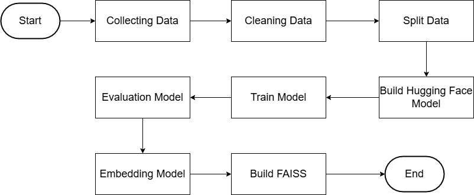

# Sentiment Analysis with Hugging Face Models

### Overview
This project is making sentiment analysis that implement hugging faces models such as "distilbert-base-uncase" and embedding using sentence transformers which that "all-MiniLM-L6-v2" and FAISS. The goal from this project to testing the classification from dataset which include text using hugging faces model and Embedding FAISS to determine whether it is positive, negative, and neutral sentiment.

### Source Dataset
Dataset got from Kaggle which contains data social media posts.

Source : 
[Sentiment Analysis](https://www.kaggle.com/datasets/mdismielhossenabir/sentiment-analysis)

### Setup Intructions
1. Clone The Repository
```bash
git clone <your-repo-url>
```
2. Download Dataset
```bash
import opendatasets as od
od.download("https://www.kaggle.com/datasets/mdismielhossenabir/sentiment-analysis")
```
This require to fill username and API key your kaggle account

3. Run Notebook
- Open the Notebook(sentiment analysis_fixed.ipynb)
### Chosen Models
1. distilbert-base-uncased (for train and testing)
2. all-MiniLM-L6-v2 (for embedding)
3. FAISS (Semantic Search)
### FlowChart

